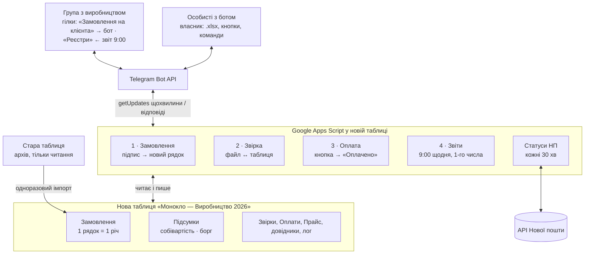

# ТЗ: Telegram-бот Монокло — замовлення, звірка, оплати

07.10.2026 · Юрій (власник)

## 1. Мета і суть рішення

Потрібен Telegram-бот, який щоранку о 9:00 (Пн–Сб) нагадує виробництву про невідправлені ТТН і робить ще три речі: сам переносить замовлення з групи «Замовлення на клієнта» в Google-таблицю «Звітність Монокло — Кузнець 2026», звіряє Excel-файли виробництва з таблицею і після підтвердження власника ставить статус «Оплачено». Мета — не платити двічі за ту саму ТТН і не вносити замовлення вручну.

Принципи реалізації (обов'язкові для Claude Code):

- **Без сервера і без хостингу.** Увесь код — Google Apps Script, прив'язаний до самої таблиці. Нічого не треба купувати, деплоїти чи тримати увімкненим комп'ютер.
- **Для людини без IT-досвіду.** Встановлення — копіювання файлів і кілька кліків у меню таблиці «🤖 Бот». Жодних терміналів, ключів Google Cloud чи сервісних акаунтів.
- **Нова таблиця, стара — архів.** Бот створює і веде нову таблицю «Монокло — Виробництво 2026» (розділ 7) і один раз імпортує в неї дані; стара таблиця лишається попередньою версією і не змінюється.
- **Гроші — лише через підтвердження людини.** Бот ніколи не ставить «Оплачено» сам; тільки після натискання кнопки власником.
- **Ідемпотентність.** Повторна обробка того самого повідомлення чи файлу не створює дублів і не позначає оплату двічі.

Оплати (суми, банк, квитанції) власник і далі вносить в аркуш «Оплати» сам — бот їх не створює (див. опцію в розділі 9).

## 2. Поточний процес і що в ньому ламається

Зараз все вручну: менеджер публікує замовлення в групі, власник переписує його в таблицю, виробництво надсилає Excel на звірку, власник звіряє очима і оплачує. Статус доставки вже оновлює наявний скрипт Нової пошти — його не чіпати.

### 2.1 Формат замовлення в групі (зі скріншота)

Одне замовлення = одне повідомлення: файл-візуал (PNG як документ) з підписом. Одразу після нього — пересланий файл принта без підпису (його бот ігнорує). Виробництво ставить ❤️ і пише «++++++».

```
1538. Принт Ferar1
Худі чорне без флісу
L

Принт позаду

20451553931463
```

### 2.2 Файл виробництва на звірку (приклад `46000.xlsx`)

Один аркуш, один рядок на ТТН, колонки `ТТН | Статус ТТН | Примітка | Дроп. ціна`. Ціна — сума всіх виробів у посилці (1160 = 420 + 740, 1680 = 4 × 420). Статуси російською: «Получено», «Отказ получателя»; відмови виробництво теж виставляє до оплати.

### 2.3 Що показав аналіз таблиці (станом на експорт)

| Факт | Цифра | Чим загрожує |
| --- | --- | --- |
| Рядків замовлень / позначених «Оплачено» | 1470 / 1059 | — |
| ТТН збережена числом, а не текстом | 1200 рядків з 1470 | Автопошук не знаходить ТТН (число ≠ текст); довгі числа можуть спотворитись |
| ТТН з кількома виробами | 144 | «Оплачено» стоїть лише на першому рядку — решта виглядає неоплаченою |
| У файлі на 46 000 грн: ТТН з «непозначеними» сусідніми рядками | 10 з 74 | Ризик повторно оплатити ці вироби |
| Собівартість усього / оплат у «Оплати» | 642 200 / 522 547 грн | Борг 119 653 грн — але з колонки «Оплата» його не видно |
| Сума рядків з «Оплачено» | 457 380 грн | На 65 167 грн менше за фактичні оплати: статуси розійшлися з грошима |
| Колонка «Колір» | «Чорна» та «Худі чорне без флісу» вперемішку | Ціну доводиться ставити вручну |
| «Розміщення принту» | 9 варіантів написання («Спереду і позаду», «Перед + Зад»…) | Фільтри і аналітика неточні |

Контрольна звірка `46000.xlsx` з таблицею: усі 74 ТТН знайдено, 0 розбіжностей у сумах, разом 46 000 грн = оплата №24 від 30.09.2026. Але вона спрацьовує лише після нормалізації ТТН: пряме порівняння дало «жодної знайденої».

## 3. Архітектура

Рішення — Google Apps Script, вбудований у таблицю: раз на хвилину таймер забирає нові повідомлення в Telegram (`getUpdates`) і пише в аркуші. Це безкоштовно, не потребує сервера (Railway/Render), Python чи сервісного акаунта Google Cloud, і забирає на себе й оновлення статусів Нової пошти (розділ 7.6).



Затримка між повідомленням і рядком у таблиці — до 1 хв; відповідь на надісланий файл — теж до 1 хв. Квоти Google (20 000 запитів на добу для безкоштовного акаунта) покривають 1440 опитувань на добу з великим запасом.

## 4. Модуль 1 — замовлення з групи → таблиця

Кожне нове повідомлення з підписом-замовленням у групі протягом \~1 хв стає рядком аркуша «Замовлення». Бот читає текст (`message.text`) або підпис до файлу/фото (`message.caption`).

### 4.1 Яке повідомлення вважати замовленням

Перший непорожній рядок починається з номера і крапки: `^\s*(\d{1,6})[.)]\s*(.+)$`. Усе інше (переслані файли принтів, «++++», обговорення) — мовчки ігнорувати. Група працює з гілками (форум). Обробляти лише повідомлення з гілки «Замовлення на клієнта»: збігаються і message\_thread\_id (збережений командою /bind orders), і група, чий `chat.id` збережено в налаштуваннях.

### 4.2 Розбір підпису → колонки

Рядки брати після `trim`, порожні пропускати. Розпізнавати за змістом, а не строго за позицією — менеджер може переставити рядки чи додати порожній.

| Рядок підпису | Колонки (розділ 7.1) | Правило |
| --- | --- | --- |
| перший: `1538. Принт Ferar1` | № замовлення, Принт, Принтів | число до крапки; текст після нього як є; «ДВА» в тексті → Принтів = 2 |
| речі: `Худі чорне без флісу` | Тип речі, Колір | «футболк» → Футболка; «худі» + «з флісом» / «утепл» → Худі фліс; «худі» + «без флісу» / «не утепл» → Худі не утеплене; худі без уточнення → тип порожній, жовта клітинка і повідомлення власнику. Колір з того ж рядка: «чорн» → Чорний, «біл» → Білий, «сір» / «графіт» → Сірий |
| розмір: `L` | Розмір | `XS S M L XL XXL XXXL 2XL 3XL`, без регістру; кириличні «М», «С», «Х» → латиниця; 2XL → XXL |
| розміщення: `Принт позаду` | Розміщення принту | позаду / спереду / спереду і позаду (або «перед + зад») / візуалі → одне з 4 значень списку |
| ТТН: `20451553931463` | ТТН | рядок = 14 цифр після видалення пробілів; записувати текстом |
| — | Дата замовлення | дата повідомлення в Telegram |
| — | Собівартість, грн | з «Прайсу» за типом речі (Футболка 420, будь-яке худі 740), числом |
| — | Статус замовлення / Оплата / Етап | `В роботі` / `Не оплачено` / заповнить блок НП (7.6) |

Рядок додавати в кінець таблиці (перший порожній рядок після останнього заповненого в колонці A), зберігаючи форматування попереднього рядка. Одна ТТН у кількох повідомленнях = кілька рядків, це норма.

### 4.3 Помилки, дублі, редагування

- **Успіх:** бот ставить на повідомлення реакцію 👌 (`setMessageReaction`) — тихо, без тексту в групі. Реакцію можна вимкнути в налаштуваннях.
- **Не вистачає поля** (розмір, виріб, ТТН) або виріб немає в прайсі: рядок все одно додати, проблемну клітинку залити жовтим, у колонку «Примітка» написати причину, а власнику — особисте повідомлення з посиланням на повідомлення в групі. Реакція — ✍️.
- **Дубль номера:** якщо № з чату вже є в таблиці — не додавати, написати власнику в особисті.
- **Повторна обробка:** зберігати `message_id` у приховану колонку; той самий `message_id` двічі не додається.
- **Редагування в Telegram** (`edited_message`): знайти рядок за `message_id` і переписати поля з підпису і собівартість. Якщо рядок уже «Оплачено» — нічого не міняти, лише попередити власника.
- **Видалення** бот не бачить (обмеження Telegram). Скасування — командою `/cancel 1538` («Статус замовлення» = Скасовано, собівартість 0) або вручну в таблиці, як зараз.
- **Немає ТТН на момент публікації:** додати рядок без ТТН; достатньо відредагувати повідомлення, і бот допише ТТН.

## 5. Модуль 2 — звірка файлу виробництва

Власник пересилає боту в особисті `.xlsx` від виробництва (виробництво надсилає файл власнику в особисті; власник пересилає його боту кнопкою «Переслати» або завантажує вручну — обидва варіанти мають працювати) — бот за хвилину відповідає зведенням: скільки можна спокійно платити, а що спірне. Нічого в таблиці на цьому кроці не змінюється, крім чернетки звірки.

### 5.1 Алгоритм

1. Прийняти `document` з `.xlsx`/`.xls`/`.csv` лише від ID зі списку власників. Завантажити через `getFile`, сконвертувати в тимчасову Google-таблицю (Drive Advanced Service, `convert`), прочитати, тимчасовий файл видалити.
2. Колонки шукати **за назвою заголовка**, не за позицією: ТТН (`ттн`, `накладна`, `штрих`), сума (`ціна`, `цена`, `сума`, `сумма`), статус, примітка. Не знайшов ТТН або суму → чітка помилка «не знайшов колонку ТТН, заголовки файлу: …».
3. **Нормалізувати ТТН з обох боків:** у рядок, прибрати пробіли, `.0`, апострофи; числа перетворювати без експоненти. Без цього на нинішній таблиці звірка не працює (див. 2.3).
4. Згрупувати рядки «Замовлення» за ТТН; для кожної ТТН з файлу порахувати суму собівартості всіх її рядків і стан оплати.
5. Присвоїти кожній ТТН з файлу одну категорію (таблиця 5.2), порахувати підсумки.
6. Записати чернетку в аркуш «Звірки» (статус `Чернетка`) і деталі по кожній ТТН у аркуш «Звірки\_деталі». Надіслати зведення з кнопками (розділ 6).

### 5.2 Категорії ТТН

| Категорія | Умова | До оплати? |
| --- | --- | --- |
| ✅ Збігається | ТТН є в таблиці, сума файлу = сума рядків, жоден рядок не оплачений | так |
| 🔁 Вже оплачено | Усі рядки ТТН мають «Оплачено»; показати дату і ID звірки, коли оплачено | **ні** |
| ⚠️ Частково оплачено | Частина рядків ТТН «Оплачено», частина ні (типовий випадок старих даних) | ні, до ручного рішення |
| ⚠️ Сума не збігається | ТТН є, але сума файлу ≠ сума рядків; показати обидві суми і різницю | ні, до ручного рішення |
| ❌ Немає в таблиці | ТТН з файлу відсутня в «Замовлення» | ні |
| ❌ Дубль у файлі | Одна ТТН двічі в одному файлі | ні (другий запис) |
| ℹ️ Відмова | Статус «Отказ получателя» / «Відмова» | як для ✅, але показати окремим рядком у зведенні |

Додатково: якщо той самий файл (хеш вмісту) або той самий набір ТТН уже був підтверджений — першим рядком зведення червоне попередження «Цей файл уже оплачено звіркою З-… від …».

### 5.3 Зведення в Telegram (приклад)

```
📄 Звірка З-2026-10-07-1 · 46000.xlsx
ТТН у файлі: 74 · сума файлу: 46 000 грн

✅ До оплати: 70 ТТН — 43 240 грн
   з них відмов: 4 — 2 760 грн
🔁 Вже оплачено: 2 ТТН — 1 160 грн
⚠️ Сума не збігається: 1 ТТН — файл 1 160 / таблиця 840
❌ Немає в таблиці: 1 ТТН — 420 грн

Проблемні ТТН — списком нижче (номер, № з чату, назва, суми)
[✅ Оплатити 43 240 грн]  [📋 Деталі]  [✖️ Скасувати]
```

Цифри в прикладі умовні. Якщо проблемних ТТН більше 30 — показати перші 30 і посилання на аркуш «Звірки\_деталі», відфільтрований за ID звірки. Суми — з роздільником тисяч і «грн». Цілі гривні: порівнювати з точністю до 0,01.

### 5.4 Окреме повідомлення про розбіжності

Якщо в файлі є хоч одна ТТН ⚠️ або ❌, чи 🔁 (виробництво виставило вже оплачене), бот одразу після зведення надсилає **друге повідомлення — лише розбіжності з різницею в гривнях**. Немає розбіжностей — цього повідомлення немає, а в зведенні стоїть «✅ Розбіжностей немає».

```
⚠️ Розбіжності · З-2026-10-07-1 · 46000.xlsx
Виробництво виставило на 1 900 грн більше, ніж по таблиці

Сума не збігається (1):
• 20451543952929 — файл 1 160 / таблиця 840 → +320 грн
  №1301 Футболка 420 · №1302 Футболка 420
  ймовірно: в файлі худі замість футболки (740 − 420)

Вже оплачено раніше (2):
• 20451534770042 — 740 грн · оплачено З-2026-09-26-1 → +740 грн
• 20451544038342 — 420 грн · оплачено З-2026-09-30-1 → +420 грн

Немає в таблиці (1):
• 20451545999999 — 420 грн → +420 грн

Разом різниця: +1 900 грн
[📤 Текст для виробництва]  [⚖️ Вирішити по кожній ТТН]
```

Правила:

- Різниця = сума файлу − сума таблиці. «+» — виробництво виставило більше, «−» — менше. Для 🔁 і ❌ уся сума рядка файлу — це різниця. Вгорі — одне речення про загальну різницю («на X грн більше / менше»).
- Під кожною ТТН з ⚠️ — розкладка рядків таблиці (№, виріб, ціна). Якщо різницю можна пояснити цінами з «Прайсу» (±320 = худі ↔ футболка, ±420 або ±740 = зайвий чи відсутній виріб) — дописати підказку «ймовірно: …».
- Для 🔁 — ID і дата звірки, якою ТТН уже оплачено (або «Імпорт» для старих оплат).
- **📤 Текст для виробництва** — бот надсилає готове нейтральне повідомлення без внутрішніх деталей (без ID звірок і підказок), яке власник пересилає виробництву: «У файлі 46000.xlsx не сходяться: <ТТН> — у вас 1 160, у нас 840 (№1301, №1302)… Перевірте, будь ласка». ТТН — моноширинним.
- **⚖️ Вирішити по кожній ТТН** — для кожної ТТН ⚠️ три кнопки: \[За таблицею 840\] \[За файлом 1 160\] \[Відкласти\]. «За файлом» оновлює собівартість у таблиці (з підтвердженням і записом старої суми в «Примітку»), щоб таблиця і оплата збігались. Після кожного вибору сума на кнопці «✅ Оплатити X грн» у зведенні перераховується. 🔁 і ❌ до оплати додати не можна.
- **Відкладені ТТН** лишаються неоплаченими з позначкою «Спірна, З-…» у «Примітці бота». Коли вони з'являться в наступному файлі, зведення нагадає: «раніше відкладено у З-…». `/disputes` — список усіх відкладених ТТН і їхня сума.
- Підсумок розбіжностей записати в «Звірки» (нова колонка «Різниця, грн»), а рішення по кожній ТТН — в «Звірки\_деталі» (нова колонка «Рішення»: за таблицею / за файлом / відкладено).

Критерій приймання: у копії `46000.xlsx` змінити суму однієї ТТН з 420 на 740 і додати вигадану ТТН на 420 → друге повідомлення показує «+320» з підказкою «худі замість футболки», «+420» для вигаданої і «Разом +740 грн».

У прикладі вище ТТН і № умовні.

### 5.5 Архів файлів виробництва

Кожен файл, надісланий на звірку, бот зберігає в оригіналі (`.xlsx` без конвертації) у папку Google Диска «Монокло — файли виробництва». Якщо її немає — створити при першому запуску поруч із таблицею, ID зберегти в «Налаштуваннях».

- Ім'я файлу: `РРРР-ММ-ДД_<ID звірки>_<оригінальна назва>` (наприклад, `2026-10-07_З-2026-10-07-1_46000.xlsx`).
- Посилання на файл — у новій колонці «Файл» аркуша «Звірки» і кнопкою «📁 Файл» в повідомленні з розбіжностями.
- Зберігати всі файли, у т.ч. скасовані та повторні звірки; нічого автоматично не видаляти.
- `/files` — посилання на папку архіву. Доступ до папки — лише власнику (як і до таблиці), без публічного посилання.

Критерій приймання: після звірки `46000.xlsx` у папці з'являється файл, який відкривається в Excel і байт-у-байт збігається з оригіналом, а в «Звірках» — посилання на нього.

## 6. Модуль 3 — підтвердження і статус «Оплачено»

Після натискання «✅ Оплатити X грн» бот ставить «Оплачено» на **всі** рядки всіх ТТН категорії ✅, і нічого більше.

### 6.1 Кнопки під зведенням

- **✅ Оплатити X грн** — підтвердити лише ТТН ✅. Перед дією — другий крок «Точно? Буде позначено N рядків на X грн» \[Так\] \[Ні\], щоб виключити випадковий тап.
- **📋 Деталі** — список проблемних ТТН + посилання на «Звірки\_деталі».
- **✖️ Скасувати** — чернетка → статус `Скасовано`, таблиця не змінюється.
- Якщо є ТТН ⚠️, додаткова кнопка **«➕ Врахувати спірні»** — відкриває вибір по кожній спірній ТТН: за таблицею / за файлом / відкласти (розділ 5.4). ТТН 🔁 і ❌ додати не можна в принципі.

### 6.2 Що відбувається при підтвердженні

1. `LockService.getScriptLock()` — два натискання не виконуються одночасно.
2. Перевірити, що звірка ще в статусі `Чернетка` (повторний тап або стара кнопка → «Вже підтверджено …»). Чернетка старша за 48 год — просити надіслати файл знову.
3. **Перевірити таблицю ще раз** — жодна ТТН з підтверджуваних не стала «Оплачено» і сума не змінилась з моменту звірки. Змінилось → зупинитись і показати нове зведення.
4. Для кожного рядка кожної ТТН: «Оплата» = `Оплачено`, «Дата оплати» = сьогодні, «Звірка» = ID. Писати пакетно (`setValues` по діапазонах), не поклітинно.
5. Звірка → `Підтверджено`, записати суму, кількість рядків, час, хто натиснув.
6. Відредагувати повідомлення зі зведенням: прибрати кнопки, дописати «✅ Підтверджено 07.10 14:32 · N рядків · X грн».

### 6.3 Відкат

`/undo З-2026-10-07-1` — прибрати «Оплачено», дату і ID лише з тих рядків, де «Звірка» = цей ID; звірка → `Відкликано`. З підтвердженням так / ні.

### 6.4 Запис у «Оплати»

Одразу після підтвердження бот питає: «Додати оплату X грн у аркуш Оплати?» \[✅ Так, X грн\] \[✏️ Інша сума\] \[Ні, внесу сам\].

- **Так** — новий рядок у кінці «Оплати»: A = наступний №, B = сьогодні, C = сума, D і E порожні (банк і квитанцію власник дописує сам), формули F–H скопійовані з попереднього рядка зі зсувом, нова колонка I «Звірка» = ID звірки.
- **Інша сума** — бот просить написати число (наприклад, коли платите частину або одразу за два файли), далі як «Так».
- Після запису бот показує новий борг (колонка H цього рядка).
- Захист від дубля: якщо в «Оплатах» уже є рядок з цим ID звірки — другий не додавати.
- `/undo` звірки не видаляє рядок оплати (гроші вже переказані), а лише нагадує власнику перевірити цей рядок.

## 6а. Модуль 4 — ранковий звіт про невідправлені ТТН

Щодня з понеділка по суботу о 09:00 (за Києвом) бот публікує в гілці «Реєстри» групи з виробництвом (sendMessage з message\_thread\_id, збереженим командою /bind report; усі частини довгого звіту — у ту саму гілку; якщо Telegram відповідає «message thread not found» — звіт не слати в загальний чат, а надіслати власнику в особисті з проханням заново зробити /bind report) список ТТН, які створені, але ще не передані Новій пошті. Найстаріші йдуть першими; під кожною ТТН — № замовлення і вироби в ній. У неділю звіту немає.

### 6а.1 Які ТТН потрапляють у звіт

- «Етап доставки» = «Не передана», тобто «Статус НП» починається з «Відправник самостійно створив цю накладну» (статус НП з кодом `1`). Інші статуси і рядки без ТТН у звіт не йдуть.
- Рядки, де «Статус замовлення» не «В роботі», пропускати.
- Рядки групувати за ТТН: одна ТТН = один пункт звіту з усіма її виробами.

Щоб статуси були свіжими, о 08:50 бот оновлює статус для ТТН, що вчора були «не передана»: викликає блок НП (розділ 7.6), тобто `TrackingDocument.getStatusDocuments` (до 100 ТТН за запит, ключ API НП — у Script Properties).

### 6а.2 Порядок сортування

Від старих до нових за датою створення ТТН — поле `DateCreated` з відповіді API НП. Бот зберігає його в нову колонку «Дата створення ТТН». Якщо дати немає — за «Датою замовлення», далі за № з чату.

### 6а.3 Вигляд повідомлення (приклад з ваших даних, дати умовні)

```
📦 Не передані до відправки — 3 ТТН · середа, 07.10

1. 20451548987230 · створена 01.10 · ❗️6 дн.
   №1462 — Принт BMW-F30-PITON · Футболка чорна · S

2. 20451549653731 · створена 02.10 · ❗️5 дн.
   №1465 — Принт — Dnipro · Футболка чорна · L
   №1466 — Принт Mariupol · Футболка біла · S

3. 20451550732615 · створена 06.10 · 1 дн.
   №1479 — Принт crown neymar · Футболка чорна · M
```

- Позначка ❗️ — на ТТН, створених 3 і більше дні тому (поріг — у «Налаштуваннях»).
- ТТН друкувати моноширинним (`<code>`), щоб її копіювали одним дотиком.
- Якщо таких ТТН немає — коротко «✅ Усі ТТН передані до відправки» (заодно показує, що бот працює).
- Довгий список розбивати на кілька повідомлень (ліміт Telegram — 4096 символів), не розриваючи пункт ТТН.

### 6а.4 Запуск і керування

- Не окремим добовим тригером (він спрацьовує десь між 9:00 і 10:00), а в наявному щохвилинному: якщо зараз Пн–Сб, час ≥ 09:00 і сьогоднішній звіт ще не надіслано (дата в Script Properties) — надіслати. Так звіт приходить о 9:00–9:01 і ніколи двічі.
- Час, дні тижня і поріг ❗️ — в аркуші «Налаштування»: `REPORT_TIME = 09:00`, `REPORT_DAYS = Пн,Вт,Ср,Чт,Пт,Сб`, `REPORT_WARN_DAYS = 3`.
- `/report` у особистих (лише власник) — надіслати той самий звіт прямо зараз власнику, для перевірки, без публікації в групі.

Критерій приймання: у понеділок о 9:00–9:01 у гілці «Реєстри» (і лише в ній) з'являється одне повідомлення; відсортовані від найстарішої ТТН з усіма № і виробами; у неділю — жодного; `/report` приходить лише власнику.

### 6а.5 Окремо власнику: посилки, що застрягли на відділенні

У той самий час (Пн–Сб, 09:00) бот надсилає **власнику в особисті** (не в групу) список посилок, які чекають клієнта на відділенні чи в поштоматі 4 дні і більше. Мета — встигнути нагадати клієнту до повернення: у таблиці 129 відмов з 1470 замовлень (\~9%), і кожна оплачується виробництву.

- Відбір: статус НП «Прибув у відділення» або «…завантажено в поштомат» (коди `7`, `8`), днів з моменту прибуття ≥ `STORAGE_WARN_DAYS` (за замовчуванням 4).
- Дату прибуття і дату початку платного зберігання брати з відповіді `getStatusDocuments` (`ActualDeliveryDate`, `DatePayedKeeping`). Якщо в «Налаштуваннях» є телефон відправника (`NP_SENDER_PHONE`), передавати його в запит — тоді НП повертає ім'я і телефон отримувача, їх показати в звіті. У таблицю телефони не записувати.
- Сортування: спочатку ті, де до повернення найменше часу.

```
🏤 Чекають на відділенні 4+ дні — 2 посилки

1. 20451548992026 · на відділенні 6 дн. · платне зберігання з 08.10
   №1460 — Принт AUDI A6 C7 · Худі чорне з флісом · S
   Олена К. · +380 67 …
```

Якщо таких посилок немає — блок не надсилати. Дані в прикладі умовні.

## 6б. Модуль 5 — місячний звіт

1-го числа кожного місяця о 09:00 бот надсилає власнику в особисті підсумок за минулий календарний місяць і дописує ті самі цифри рядком у новий аркуш «Місячні звіти». Якщо 1-ше число — неділя, звіт все одно надсилається.

| Показник | Як рахувати |
| --- | --- |
| Замовлено виробів | рядки з «Датою створення ТТН» у місяці, а за її відсутності — з «Датою замовлення»; лише «В роботі». Розбивка за «Типом речі»: футболки / худі фліс / худі не утеплене |
| Собівартість за місяць | сума «Собівартості» тих самих рядків |
| Оплачено за місяць | сума аркуша «Оплати» за датою оплати в місяці |
| Борг на кінець місяця | собівартість усіх замовлень до кінця місяця − усі оплати до кінця місяця |
| Відмови | кількість і собівартість рядків місяця зі статусом «Відмова…»; % від усіх посилок з кінцевим статусом (отримано + відмова) |
| Топ-10 принтів | за колонкою B: прибрати префікс «Принт/Принти», звести до нижнього регістру; загальні назви без дизайну («Принт нижче», «Принт нижче ДВА») не рахувати |
| Порівняння | до кожного числа — зміна до попереднього місяця (▲/▼, %) |

Щоб місячний звіт працював і для старих даних, імпорт (розділ 7.5) одноразово заповнює «Дату створення ТТН» для всіх імпортованих ТТН через API НП (\~1470 ТТН = \~15 запитів по 100). `/month` — надіслати звіт за минулий місяць зараз; `/month 2026-08` — за вказаний місяць.

Критерій приймання: `/month 2026-09` показує суму оплат за вересень, що збігається з ручним підсумком аркуша «Оплати» (за вашими даними — 178 380 грн: оплати №17–24), і додає рядок у «Місячні звіти».

## 7. Нова таблиця «Монокло — Виробництво 2026»

Бот працює з новою таблицею; стара «Звітність Монокло — Кузнець 2026» лишається архівом і не змінюється. Головні зміни: один рядок = одна річ, окрема колонка «Тип речі», собівартість ставиться в кожний новий рядок, а всі суми винесені з заголовка в окремий аркуш «Підсумки». Скрипт знаходить колонки за назвами заголовків, а не за літерами; у цьому ТЗ колонки теж названо за назвами.

### 7.1 Аркуш «Замовлення»

| Колонка | Хто заповнює | Значення і формат |
| --- | --- | --- |
| A «№ замовлення» | бот | номер з чату (`1538`) |
| B «Дата замовлення» | бот | дата повідомлення, `ДД.ММ.РРРР` |
| C «Принт» | бот | текст після номера, як є (`Принт Ferar1`) |
| D «Тип речі» | бот | список: `Футболка` · `Худі фліс` · `Худі не утеплене` |
| E «Колір» | бот | список: `Чорний` · `Білий` · `Сірий` |
| F «Розмір» | бот | список: `XS S M L XL XXL XXXL`, лише латиницею |
| G «Розміщення принту» | бот | список: `Позаду` · `Спереду` · `Спереду і позаду` · `Як на візуалі` |
| H «Принтів» | бот | `1` або `2` («ДВА» в підписі → 2); ціна від цього не залежить |
| I «ТТН» | бот | текст, 14 цифр, формат колонки «Простий текст» |
| J «Дата створення ТТН» | бот (НП) | `DateCreated` з API НП |
| K «Етап доставки» | бот (НП) | список з кольором: `Немає ТТН` · `Не передана` · `В дорозі` · `На відділенні` · `Отримано` · `Відмова` · `Повернення` |
| L «Статус НП» | бот (НП) | повний текст статусу, як зараз |
| M «Собівартість, грн» | бот | з «Прайсу» за типом речі **в момент додавання рядка**; число, не формула — зміна прайсу не змінює старих рядків |
| N «Статус замовлення» | бот / власник | список: `В роботі` · `Скасовано` · `Переробка` · `Брак`; не «В роботі» → собівартість 0 |
| O «Оплата» | бот після звірки | список з кольором: `Не оплачено` · `Оплачено` · `Спірна` |
| P «Дата оплати» | бот | дата підтвердження звірки |
| Q «Звірка» | бот | ID звірки або `Імпорт` |
| R «Примітка» | бот / власник | причина жовтої клітинки, спірна сума, коментарі |
| S «msg\_id» | бот | прихована |
| T «Дата передачі НП» | бот (НП) | дата і час, коли бот вперше побачив етап після «Не передана»; записується один раз (розділ 7.7) |

Оформлення: один рядок заголовка без сум, закріплені рядок 1 і колонка A, фільтри, чергування кольору рядків; списки — через перевірку даних з аркуша «Довідники»; «Етап доставки» і «Оплата» — умовне форматування (наприклад, Відмова — червоний, Отримано — зелений, Не передана — помаранчевий); собівартість у форматі `# ##0 грн`.

### 7.2 Аркуш «Підсумки» — окреме вікно собівартості

Перший аркуш у файлі. Усі числа — формули (`SUMIFS`, `COUNTIFS`, `QUERY`) від аркушів «Замовлення» і «Оплати», тож оновлюються самі з кожним новим рядком. Великі картки зверху, під ними таблиці.

| Блок | Що показує |
| --- | --- |
| Картки | Собівартість усього · Оплачено усього · **Борг** · Остання оплата (дата, сума) |
| Сьогодні | додано речей і їхня собівартість; ТТН «Не передана»; посилок «На відділенні» 4+ дні |
| Поточний місяць | речей за типом (Футболка / Худі фліс / Худі не утеплене), собівартість, оплачено, відмови (шт., грн, %) |
| До оплати наступної звірки | сума «Не оплачено» для етапів «Отримано» + «Відмова» — орієнтир, скільки виробництво має виставити |
| По місяцях | таблиця місяць × тип речі: кількість і собівартість (`QUERY` за датою створення ТТН) |
| Спірні | кількість і сума рядків «Спірна» |

Аркуш захищений від редагування (лише перегляд), щоб випадково не стерти формули.

### 7.3 Аркуш «Оплати»

Ті самі колонки, що й зараз: № оплати · Дата оплати · Сума оплати · Спосіб / банк · № квитанції · Накопичено оплат · Собівартість · Залишок боргу, плюс «Звірка» (ID). «Собівартість» береться з «Підсумків», а не з клітинки в заголовку «Замовлень».

### 7.4 Службові аркуші

| Аркуш | Колонки | Призначення |
| --- | --- | --- |
| Прайс | Тип речі · Собівартість, грн · Діє з (дата) · Примітка | **Історія цін.** Початкові рядки: Футболка 420 · Худі фліс 740 · Худі не утеплене 740, діє з 01.01.2026. Нова ціна = новий рядок з датою, старі рядки не видаляються і не переписуються. Бот бере ціну, що діяла на «Дату замовлення» (останній рядок цього типу з «Діє з» ≤ дати). Команда `/price Худі фліс 780 15.11.2026` додає рядок з телефона (з підтвердженням), `/price` без параметрів показує чинні ціни. У звірці: якщо різниця по ТТН дорівнює різниці старої і нової ціни, підказка «ймовірно: нова ціна з …». Новий тип одразу з'являється в списку «Тип речі» |
| Довідники | Колір · Розмір · Розміщення · Етап · Статус замовлення · Оплата | джерело випадаючих списків |
| Звірки | ID · Дата · Файл (посилання) · Хеш · ТТН у файлі · Сума файлу · До оплати · Різниця, грн · Підтверджена сума · Статус · Час підтвердження | журнал звірок; статуси `Чернетка / Підтверджено / Скасовано / Відкликано` |
| Звірки\_деталі | ID звірки · ТТН · № замовлень · Речі · Сума файлу · Сума таблиці · Різниця · Статус з файлу · Категорія · Рішення | рядок на кожну ТТН кожної звірки |
| Місячні звіти | Місяць · Речей · Футболок · Худі фліс · Худі не утеплене · Собівартість · Оплачено · Борг на кінець · Відмов · Відмов, грн · % відмов | один рядок на місяць (модуль 6б) |
| Налаштування | Параметр · Значення | ID власника, групи і гілок, `REPORT_TIME`, `REPORT_DAYS`, `REPORT_WARN_DAYS`, `STORAGE_WARN_DAYS`, `NP_SENDER_PHONE`, `MONTHLY_REPORT`, ID папки архіву. Токени (Telegram, НП) тут **не** зберігати |
| Лог | Час · Рівень · Подія · Деталі | останні 2000 подій |

Усі аркуші, списки, формати і формули «Підсумків» створює скрипт пунктом меню «Перше налаштування» у порожній таблиці.

### 7.5 Імпорт із попередньої версії

Меню «Імпорт з попередньої версії» → вставити посилання на стару таблицю. Скрипт лише читає її, нічого там не змінює. Правила перенесення (перевірено на експорті від 07.10):

| Стара колонка | Нова | Правило |
| --- | --- | --- |
| «Колір» = `Чорна` / `Біла` / `Сіра` (1329 рядків, усі по 420 або 0) | Тип + Колір | Футболка + Чорний / Білий / Сірий |
| «Колір» = `Футболка чорна/біла/сіра` (51) | Тип + Колір | Футболка + колір |
| «Колір» = `Худі … без флісу` (67) / `Худі … з флісом` (21) | Тип + Колір | Худі не утеплене / Худі фліс + колір |
| «Розмір» кирилицею `М` (190) | Розмір | `M` |
| «Розміщення» (9 варіантів) | Розміщення | Позаду → Позаду; Спереду → Спереду; «Спереду і позаду», «Перед + Зад» → Спереду і позаду; «Принти як на візуалі», «Як на візуалі» → Як на візуалі; решта («Стандартне», «—», «Без принту», порожнє) → порожньо, оригінал — в «Примітку» |
| «Назва» зі словом «ДВА» (150) | Принтів | 2, решта — 1 |
| Собівартість 0 (7 рядків) | Статус замовлення | за назвою: «переробк» → Переробка; «брак» → Брак; «скасов», «відмін» → Скасовано |
| «ТТН» (число або текст) | ТТН | текст без `.0` і пробілів |
| «Оплата» | Оплата + Звірка | Якщо хоч один рядок ТТН «Оплачено» — усі рядки ТТН «Оплачено», Звірка = `Імпорт` (рішення власника 07.10); інакше «Не оплачено» |
| «Статус доставки» | Статус НП, Етап, Дата створення ТТН | після імпорту оновити з API НП (\~15 запитів по 100 ТТН) |
| — | Дата замовлення | для старих рядків порожньо |

Аркуш «Оплати» переноситься як є (24 оплати), «Звірка» порожня. Після імпорту бот надсилає власнику контрольні цифри і список рядків, які не вдалося розпізнати. Критерій приймання: рядків 1470 (або стільки, скільки в старій на момент імпорту), сума собівартості 642 200 грн, сума оплат 522 547 грн, борг у «Підсумках» 119 653 грн — ті самі, що в старій таблиці.

### 7.6 Статуси Нової пошти

Скрипт статусів НП зараз живе в старій таблиці, тому його логіка переноситься в новий проєкт (файл `NovaPoshta.gs`; власник надасть старий `NovaPoshtaStatus.gs`). Кожні 30 хв — оновлення рядків, де етап не кінцевий (кінцеві: Отримано, Повернення після отримання відправником), пакетами до 100 ТТН. Записуються «Статус НП» (текст), «Етап доставки» і «Дата створення ТТН». Етап визначається за `StatusCode` з відповіді API; таблицю відповідності кодів Claude Code складає за документацією НП і тримає в одному місці коду; невідомий код → етап не змінювати, запис у «Лог». Перевірити на реальних ТТН з кожним текстом статусу, що є в старій таблиці.

### 7.7 Швидкість виробництва

Бот міряє, скільки днів минає від замовлення до передачі посилки Новій пошті, і показує це в «Підсумках» та місячному звіті — щоб було видно, чи виробництво прискорюється, а не лише окремі прострочені ТТН.

- **Дата передачі.** API НП не дає надійної дати прийому посилки, тому бот фіксує її сам: під час оновлення статусів (кожні 30 хв) перший раз, коли етап змінився з «Не передана» на будь-який інший, записує поточний час у «Дату передачі НП» (точність ±30 хв). Якщо ТТН додали вже переданою — дата порожня, рядок не враховується.
- **Термін** = Дата передачі НП − Дата замовлення, у днях з одним знаком після коми. Рахується по ТТН (не по речах), від найстарішої дати замовлення в ній; тільки «В роботі». Імпортовані рядки (без дати замовлення) не враховуються, тож перші цифри з'являться після запуску бота.
- **Показники** (у «Підсумках» — за поточний місяць і останні 7 днів; у місячному звіті — за минулий місяць з ▲/▼ до попереднього): середній і медіанний термін; частка ТТН, переданих за ≤1 день, 2 дні, 3+ дні; найдовша ТТН місяця (№, днів).
- У місячному звіті (розділ 6б) — окремий рядок «Швидкість виробництва»; в аркуші «Місячні звіти» — колонки «Середній термін, дн» і «% за ≤1 день».

Критерій приймання: замовлення з датою 06.10, чия ТТН змінила етап на «В дорозі» 08.10, дає термін ≈ 2 дні і потрапляє в кошик «2 дні»; повторне оновлення статусу не змінює «Дату передачі НП».

## 8. Команди, доступ і безпека

У групі бот пише лише ранковий звіт (розділ 6а) і ставить реакції; усе спілкування — в особистих з власником. Команди зареєструвати через `setMyCommands`, щоб вони були в меню «/».

| Команда | Де | Що робить |
| --- | --- | --- |
| `/start`, `/help` | особисті | коротка інструкція українською |
| `/bind orders`, `/bind report` | гілка в групі | запам'ятати цю гілку (`chat.id` + `message_thread_id`): `orders` — звідси брати замовлення, `report` — сюди слати ранковий звіт. Лише власник |
| надіслати `.xlsx` | особисті | запустити звірку |
| `/borg` | особисті | борг: собівартість усього − сума «Оплати»; неоплачені та доставлені ТТН (кількість, сума) |
| `/find <ТТН або №>` | особисті | показати рядки, статус оплати і звірку |
| `/cancel <№>` | особисті | скасувати замовлення (собівартість 0) |
| `/history` | особисті | останні 10 звірок |
| `/undo <ID>` | особисті | відкликати звірку (розділ 6.3) |

Безпека:

- Токен бота — лише в `PropertiesService.getScriptProperties()`, вводиться через діалог у меню. Не в коді і не в клітинках.
- Будь-яке оновлення з чужого чату або від чужого користувача ігнорувати мовчки (запис у «Лог»). Кнопки оплати працюють лише для ID власників — перевіряти `callback_query.from.id`.
- Перший, хто надішле боту `/start` після встановлення, стає власником; далі список редагується лише в аркуші «Налаштування».
- Бот додається в групу як адміністратор без жодних прав (це потрібно, щоб він бачив усі повідомлення і реакції) або з вимкненим режимом приватності в BotFather.

## 9. Покращення процесу

Найбільший ефект дають перші два пункти: без них захист від повторної оплати на старих даних працюватиме частково.

| # | Покращення | Що дає | В цьому ТЗ? |
| --- | --- | --- | --- |
| 1 | **Одноразова міграція:** перевести всі ТТН у текст і на ТТН з кількома рядками поширити «Оплачено» з першого рядка на решту | Таблиця показує реальний стан оплат | так: під час імпорту в нову таблицю (розділ 7.5); стара не змінюється |
| 2 | Статус оплати — на кожному рядку ТТН, а не на першому | Неможливо оплатити другий виріб тієї ж посилки вдруге | так (розділ 6) |
| 3 | Аркуш «Прайс» замість ручних 420/740 | Зміна ціни — в одній клітинці, для нових замовлень | так |
| 4 | Випадаючі списки для «Розміщення» і «Оплата» | Чисті фільтри, без 9 написань одного значення | так |
| 5 | ID звірки в аркуші «Оплати» (нова колонка I) | Видно, яка оплата покрила які ТТН; бот може підказати «немає оплати на 46 000 для З-…» | опція: після підтвердження бот пропонує «Додати рядок у Оплати?» (дата + сума + ID; банк і квитанцію власник дописує сам). Увімкнено (рішення власника 07.10), деталі — розділ 6.4 |
| 6 | Розділити «Колір» на «Виріб» і «Колір» | Аналітика за типом виробу і кольором | так — «Тип речі» і «Колір» у новій таблиці (розділ 7.1) |
| 7 | Реакція ❤️ / «++++» від виробництва → колонка «Прийнято виробництвом» | Видно, що виробництво не взяло в роботу | **не робити** (рішення власника 07.10): контроль виробництва — лише за статусами ТТН НП і ранковим звітом (розділ 6а) |
| 8 | Щотижневе зведення власнику в понеділок 09:00: замовлень, відмов, борг, ТТН «отримано, але не виставлено виробництвом» | Контроль без відкривання таблиці | етап 2 |
| 9 | Попросити виробництво додавати в Excel колонку «№ з чату» | Другий ключ звірки, якщо ТТН змінили | бот враховує її, якщо вона є |

Рішення власника (07.10.2026) щодо пункту 1: якщо перший рядок ТТН позначений «Оплачено», решта її рядків теж оплачені. Імпорт ставить їм «Оплачено», а в колонку «Звірка» — позначку `Імпорт`, щоб їх можна було відфільтрувати або відкотити.

## 10. Результат роботи, встановлення і приймання

### 10.1 Що має віддати Claude Code

- Файли Apps Script: `appsscript.json` (часовий пояс `Europe/Kyiv`, Drive Advanced Service v2 увімкнений у маніфесті, потрібні scopes), `Config.gs`, `Telegram.gs`, `Orders.gs`, `Reconcile.gs`, `Menu.gs`, `Reports.gs` (розділи 6а, 6б), `NovaPoshta.gs` (перенесена логіка старого скрипта, розділ 7.6), `Import.gs` (розділ 7.5), `Summary.gs` (формули «Підсумків»). Імена всіх функцій — з префіксом `bot_`.
- Окремий файл `ІНСТРУКЦІЯ.md` українською, кроки нижче, без технічних термінів.
- Тестова функція `bot_selfTest()` з тестами парсера на прикладах із розділу 2.1 і варіантах з помилками.

### 10.2 Встановлення для власника (\~15 хвилин)

1. В Telegram відкрити @BotFather → `/newbot` → придумати назву → скопіювати токен. Там же `/setprivacy` → обрати бота → `Disable`.
2. Додати бота в групу «Замовлення на клієнта» і зробити адміністратором (усі перемикачі прав можна вимкнути).
3. Створити нову порожню Google-таблицю «Монокло — Виробництво 2026», відкрити її → **Розширення → Apps Script**. Для кожного файлу з папки: «+» → Скрипт → назва → вставити вміст. `appsscript.json`: ⚙️ Налаштування проєкту → «Показувати файл маніфесту» → замінити вміст. Зберегти.
4. Оновити сторінку таблиці → з'явиться меню **🤖 Бот** → «Перше налаштування» → дозволити доступ (Google покаже попередження → «Додаткові налаштування» → «Перейти») → вставити токен.
5. Написати боту в особисті `/start`. Потім у групі: у гілці «Замовлення на клієнта» написати `/bind orders`, у гілці «Реєстри» — `/bind report`. Після кожної команди бот відповість «Готово» у тій самій гілці і видалить свою відповідь через 10 секунд.
6. Меню 🤖 Бот → «Імпорт з попередньої версії» → вставити посилання на стару таблицю (один раз; стара не змінюється). Бот надішле контрольні цифри — звірити зі старою.

Інші пункти меню: «Увімкнути / Вимкнути бота», «Перевірити, що все працює» (токен, група, тригер, останнє опитування — зелені/червоні пункти), «Відкрити лог».

### 10.3 Технічні вимоги до коду

- Отримання оновлень — `getUpdates` з таймерного тригера раз на 1 хв; `offset` зберігати в Script Properties після кожного успішно обробленого оновлення. Вебхук (`doPost`) **не** використовувати: веб-додаток Apps Script відповідає перенаправленням 302, Telegram вважає це помилкою і надсилає повторно — це джерело дублів. При встановленні викликати `deleteWebhook`.
- `allowed_updates`: `message`, `edited_message`, `callback_query`, `my_chat_member`.
- Усі записи в таблицю — під `LockService`; один запуск тригера ≤ 5 хв; помилка в одному оновленні не блокує решту (лог + повідомлення власнику).
- Усі тексти бота — українською, HTML-розмітка, дати у форматі `ДД.ММ.РРРР`.

### 10.4 Критерії приймання

- [ ] Повідомлення з розділу 2.1 за ≤ 2 хв з'являється рядком: `1538 · Принт Ferar1 · Худі не утеплене · Чорний · L · Позаду · 20451553931463 (текст) · 740`; на повідомленні реакція 👌.
- [ ] Пересланий файл принта без підпису і «++++++» не створюють рядків.
- [ ] Повідомлення без розміру → рядок з жовтою клітинкою і особисте повідомлення власнику.
- [ ] Редагування повідомлення в групі оновлює той самий рядок, не створює новий.
- [ ] `46000.xlsx` на **поточній** таблиці (після імпорту): 74 ТТН, 46 000 грн, усі 74 — 🔁 «Вже оплачено», до оплати 0 грн, кнопки оплати немає.
- [ ] `46000.xlsx` на копії таблиці, де ці ТТН не оплачені: 74 ✅, 46 000 грн до оплати, відмов 4. Після підтвердження — 92 рядки «Оплачено» з однаковим ID звірки.
- [ ] Повторне надсилання того самого файлу → червоне попередження і 0 грн до оплати. Подвійний тап по «Оплатити» → одне підтвердження.
- [ ] Файл із зміненою сумою однієї ТТН і однією вигаданою ТТН → по одній ⚠️ і ❌, їхні суми не входять у «До оплати».
- [ ] `/undo` повертає таблицю до стану до підтвердження; «Підсумки» і «Оплати» показують ті самі суми, що й до звірки.
- [ ] Повідомлення або файл від сторонньої людини ігноруються.
